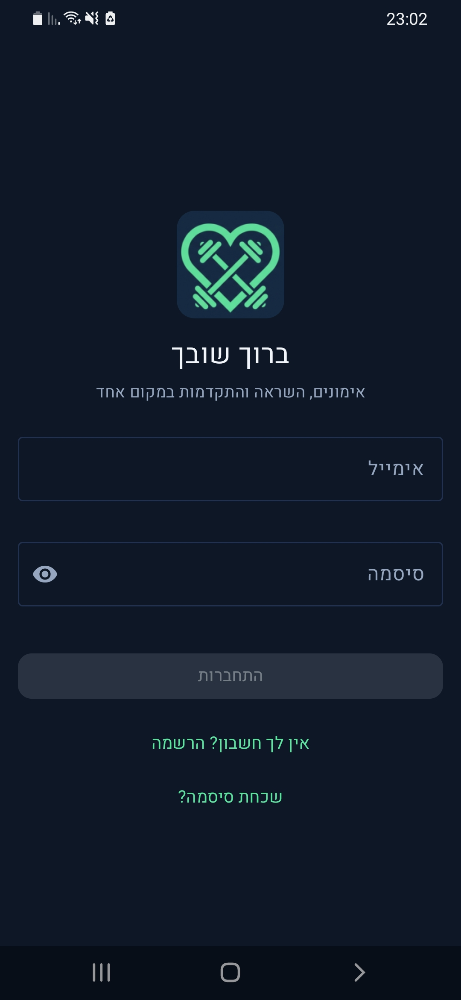
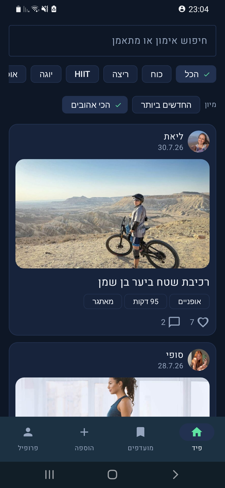
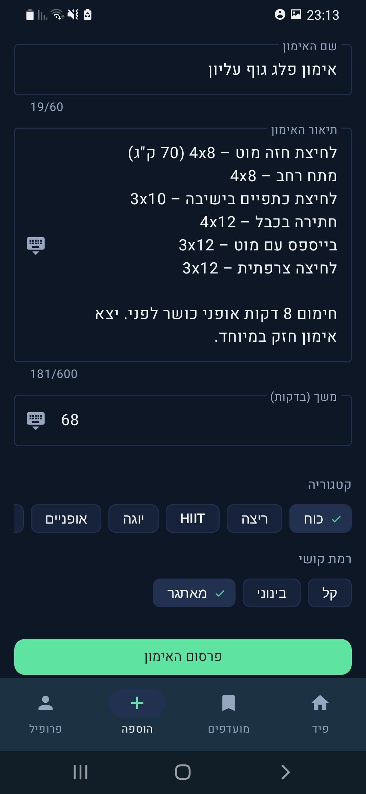
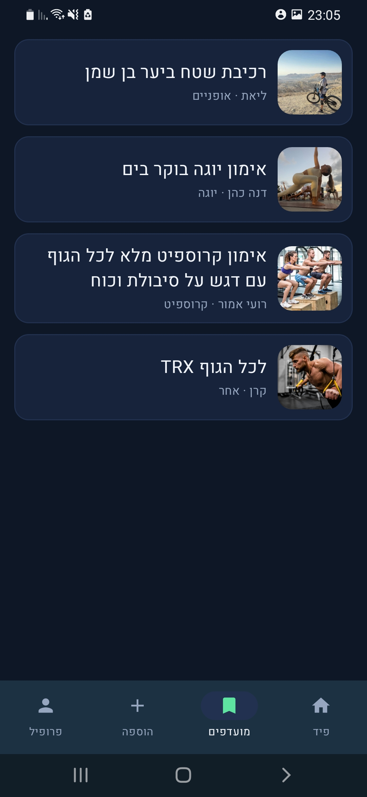
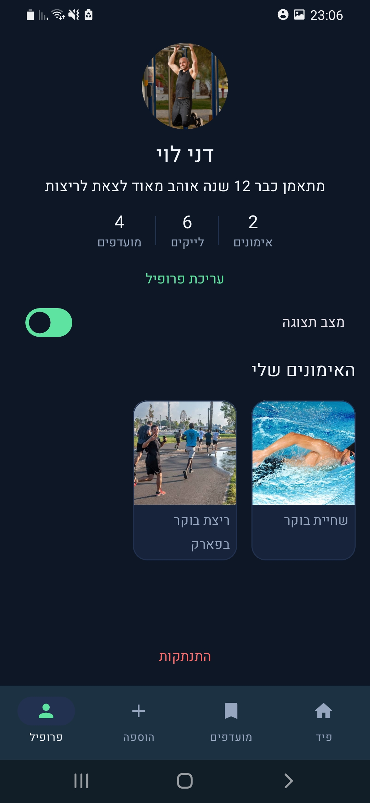
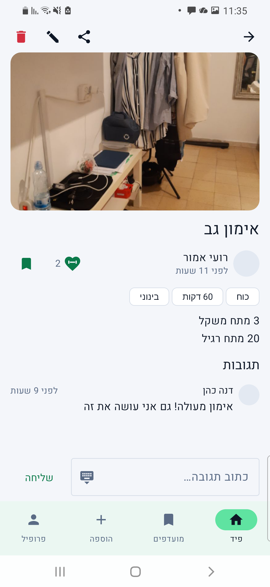
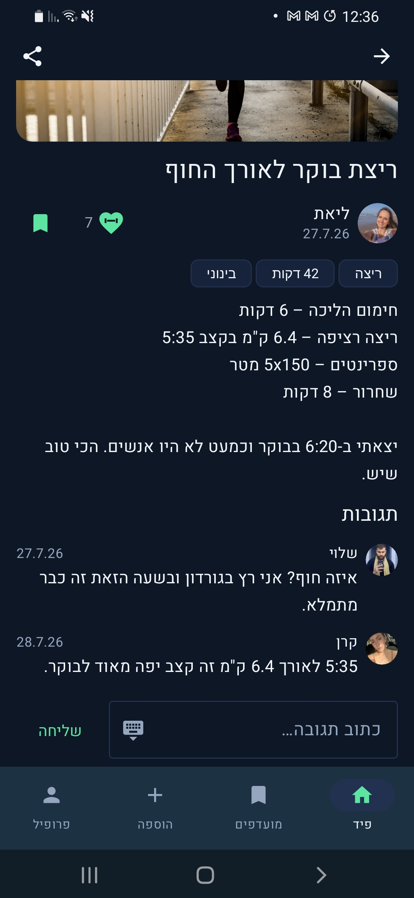

<div dir="rtl" align="right">

# FitShare

**אימונים, השראה והתקדמות במקום אחד**

אפליקציית אנדרואיד חברתית בעברית שבה מתאמנים מפרסמים את האימון שסיימו, עם תמונה, ואחרים גולשים,
עושים לייק, מגיבים ושומרים למועדפים.

פרויקט גמר בקורס פיתוח אנדרואיד. נכתב ב‑Kotlin עם XML Views, ארכיטקטורת MVVM ו‑Firebase.


קישור לסרטון : https://drive.google.com/file/d/1kuAKpomSPCNxXAwVZiB_lBEEIECejN9b/view?usp=sharing
</div>

---

<div dir="rtl" align="right">

## 1. מה האפליקציה עושה, ואיזו בעיה היא פותרת

מי שמתאמן באופן קבוע נתקל בשתי בעיות שאין להן פתרון טוב:

1. **תיעוד האימון הולך לאיבוד.** אנשים מצלמים את האימון ושולחים לקבוצת וואטסאפ, ותוך יומיים
   התמונה נבלעת בין הודעות. אין רשימה, אין חיפוש, אין דרך לחזור לאימון שעשית לפני חודש.
2. **אין מאיפה לקחת רעיונות.** רשתות כלליות מציפות בתוכן שיווקי של מאמנים מקצועיים; מה שחסר זה
   לראות מה **אנשים אמיתיים** באמת עשו היום — כמה זמן, באיזו רמת קושי, ואיך זה נראה.

FitShare עונה על שתיהן עם דבר אחד: פיד של אימונים אמיתיים, בעברית, שכל אחד יכול לפרסם אליו תוך
פחות מדקה, ולשמור ממנו אימונים שמעניינים אותו.

### מה יש באפליקציה

- הרשמה, התחברות, איפוס סיסמה, שמירת חיבור בין הפעלות
- פרסום אימון עם תמונה מהמצלמה או מהגלריה, כולל דחיסה לפני העלאה
- פיד חי (real‑time) של כל האימונים, החדשים למעלה
- סינון לפי קטגוריה, חיפוש לפי שם אימון או שם מתאמן, מיון לפי חדשים או לפי הכי אהובים
- לייק עם מונה חי, תגובות (הוספה, צפייה, מחיקה של שלך)
- שמירה למועדפים ורשימת מועדפים
- מסך פרטי אימון מלא, עם שיתוף כטקסט
- פרופיל אישי עם שלוש סטטיסטיקות וגריד אימונים, עריכת פרופיל, וצפייה בפרופיל של משתמש אחר
- עריכה ומחיקה של אימון שאתה פרסמת
- מצב כהה ובהיר עם מתג שנשמר בין הפעלות
- באנר "אין חיבור לאינטרנט"
- כל האפליקציה בעברית, RTL מלא

</div>

---

<div dir="rtl" align="right">

## 2. צילומי מסך וּוידאו

כל הצילומים צולמו על מכשיר פיזי — Samsung Galaxy A30, Android 11 — ושמורים תחת
`docs/screenshots/`.

| התחברות | פיד האימונים | העלאת אימון |
|---|---|---|
|  |  |  |

| מועדפים | פרופיל אישי |
|---|---|
|  |  |

### מסך פרטי אימון, באותו מסך בדיוק — בהיר מול כהה

הצמד הזה קיים כדי להראות דבר אחד: אותו מסך, אותו תוכן, שתי ערכות הנושא. המתג נשמר בין הפעלות
(סעיף 1), ולכן שווה לראות ששתי הגרסאות עומדות בפני עצמן ולא רק אחת מהן.

| מצב בהיר | מצב כהה |
|---|---|
|  |  |

**וידאו הדגמה:** `להוסיף קישור כאן`

</div>

---

<div dir="rtl" align="right">

## 3. ארכיטקטורה

MVVM בארבע שכבות, בלי Hilt ובלי Dagger — ההזרקה נעשית ביד ב‑`di/ServiceLocator.kt` וב‑`ViewModelFactory`,
כדי שאפשר יהיה לקרוא את כל החיווט מלמעלה למטה בישיבה אחת.

### זרימת נתונים

</div>

```
                 ┌──────────────────────────────────────────────┐
                 │  Firebase Auth · Cloud Firestore · Cloudinary│
                 └──────────────────────┬───────────────────────┘
                                        │
                        DataSource  ────┴────  the only layer that
                 AuthDataSource · UserDataSource · WorkoutDataSource
                 InteractionDataSource · CloudinaryImageUploader
                                        │        knows Firebase/Retrofit exist
                                        │
                                        │   suspend fun ... : Result<T>
                                        │   fun observe...() : Flow<Result<T>>
                                        ▼
                        Repository  (interface + Impl)
                 AuthRepository · UserRepository · WorkoutRepository
                            InteractionRepository
                                        │
                                        │   the ViewModel depends on the
                                        │   interface, never on Firestore
                                        ▼
                             ViewModel  (viewModelScope)
                 combine(flow, filter, search, sort).asLiveData()
                                        │
                    LiveData<XUiState>  │  LiveData<Event<T>>
                    (one immutable      │  (one-shot: navigate,
                     state per screen)  │   snackbar)
                                        ▼
                              Fragment  (ViewBinding)
                 inflates · observes · renders · forwards clicks
                                        │
                                        ▼
                                     XML View
```

<div dir="rtl" align="right">

### חוקי השכבות

| שכבה | מותר לה | אסור לה |
|---|---|---|
| `Fragment` | לנפח layout, להאזין ל‑`LiveData`, לצייר מצב, להעביר אירועים ל‑ViewModel | קריאות Firebase, לוגיקה עסקית |
| `ViewModel` | `viewModelScope`, לחבר זרם חי עם מצב מסך, לחשוף `LiveData` | לגעת ב‑`View`, ב‑`Context` או ב‑`Fragment` |
| `Repository` | ממשק + מימוש אחד, מחזיר `Result<T>` או `Flow<Result<T>>` | להיחשף כמחלקה קונקרטית ל‑ViewModel |
| `DataSource` | להכיר את Firestore / Retrofit | לזלוג החוצה — אף שכבה אחרת לא מייבאת Firebase |

**זרמים חיים** מוחזרים מה‑Repository כ‑`Flow<Result<T>>` (מאזין Firestore עטוף ב‑`callbackFlow`).
ה‑ViewModel מחבר את הזרם עם מצב המסך — סינון, חיפוש, מיון — ומסיים ב‑`.asLiveData()`.
**ה‑Fragment רואה תמיד ורק `LiveData`.**
הסיבה: בפיד צריך לחבר זרם חי אחד עם שלושה מצבי ממשק, ולעשות את זה ב‑LiveData דורש
`MediatorLiveData` מקונן — קשה יותר לקריאה וקשה יותר להגנה.

### מבנה החבילות

</div>

```
com.roeiamor.fitshare/
├── FitShareApp.kt          אתחול ה־ServiceLocator
├── MainActivity.kt         ה‑Activity היחיד: NavHost + BottomNavigationView
├── data/
│   ├── model/              data classes בלבד, בלי שום import של אנדרואיד
│   ├── remote/             DataSources, CloudinaryApi, ImageUploader
│   └── repository/         ממשק + מימוש לכל תחום
├── di/                     ServiceLocator, ViewModelFactory
├── ui/
│   ├── auth/  feed/  addworkout/  details/  favorites/  profile/
│   └── common/             BaseFragment, StateRenderer, LikeButton,
│                           EnumLabels, TimeLabels, NumberLabels, MetaChips
└── util/                   Result, ErrorMapper, TimeFormatter, ImageCompressor,
                            Validators, NetworkMonitor, NetworkGuard, ThemePreferences
```

<div dir="rtl" align="right">

### החלטות שכדאי להכיר

- **מסך פרופיל אחד**, לא שניים. `ProfileFragment` מקבל `userId` שיכול להיות `null`: `null` פירושו
  "הפרופיל שלי" (עם עריכה, מתג תצוגה והתנתקות), ערך אמיתי פירושו פרופיל של מישהו אחר, לקריאה בלבד.
  שני מסכים כמעט זהים שחולקים layout הם בדיוק הכפילות שהמחוון מוריד עליה נקודות.
- **טופס ההוספה משמש גם כעורך**, מאחורי `workoutId` שיכול להיות `null` — מאותה סיבה בדיוק.
- **כל מסך מטפל בארבעה מצבים**: טעינה, ריק, שגיאה, תוכן. שלושת מצבי הביניים הם שלושה layouts
  משותפים שמוכנסים ב‑`<include>`, ו‑`ui/common/StateRenderer` הוא המקום היחיד שמחליט מי מוצג.
- **שגיאות מתורגמות לעברית במקום אחד בלבד** — `util/ErrorMapper.kt`. הוא מחזיר `@StringRes Int`
  ולא מחרוזת, ולכן הוא לא צריך `Context`, ה‑ViewModel יכול לקרוא לו והוא נבדק ביוניט טסטים.
- **המודלים נקיים מאנדרואיד.** `data/model/` בלי `R`, בלי `@StringRes`, בלי `android.*`. ה‑enums
  הם קבועים בלי ארגומנטים, והתרגום שלהם לעברית קורה בפונקציה אחת בשכבת ה‑UI (`EnumLabels.kt`).
- **הניווט התחתון מחווט ביד** ולא דרך `NavigationUI.setupWithNavController`. העוזר הזה נכתב
  לאפליקציה שהטאבים שלה הם גרפים מקוננים, ומול הגרף השטוח כאן הוא שומר ומשחזר את המסך שנפתח מעל
  הטאב — מה שגרם לניווט התחתון להפסיק לעבוד אחרי כניסה לאימון. הפירוט ב‑KDoc של
  `MainActivity.setUpBottomNavigation`.

</div>

---

<div dir="rtl" align="right">

## 4. ספריות: מה, למה, ואיפה

</div>

| ספרייה | גרסה | למה דווקא היא | איפה בקוד |
|---|---|---|---|
| `firebase-auth` | BOM 34.17.0 | רכיב שרת #1. הרשמה, התחברות, איפוס סיסמה וסשן מתמיד — בחינם וללא הגבלה | `AuthDataSource`, מסכי `ui/auth` |
| `firebase-firestore` | BOM 34.17.0 | רכיב שרת #2. כל מודל הנתונים, עם מאזינים בזמן אמת ו‑`runTransaction` למונים | `WorkoutDataSource`, `InteractionDataSource`, `UserDataSource` |
| `firebase-bom` | 34.17.0 | מיישר את כל גרסאות Firebase לסט תואם אחד, כך שהמודולים מוצהרים בלי גרסה | `app/build.gradle.kts` |
| `kotlinx-coroutines-play-services` | 1.10.2 | נותן `await()` שהופך `Task<T>` של Firebase לקריאת `suspend`. בלעדיו חוזרים ל‑callbacks מקוננים | כל ה‑DataSources |
| `navigation-fragment-ktx` | 2.9.8 | NavHost והחלפת הפרגמנטים — הבסיס לארכיטקטורת ה‑Activity היחיד | `MainActivity`, `nav_graph.xml` |
| `navigation-ui-ktx` | 2.9.8 | נשאר בפרויקט בשביל `NavOptions` ו‑`navOptions {}`; החיווט של הבר עצמו נכתב ביד (ראה §3) | `MainActivity` |
| `navigation.safeargs.kotlin` | 2.9.8 | מייצר מחלקות Args/Directions מהגרף. בלעדיו ארגומנטים נוסעים כמחרוזות ב‑Bundle — מקור קלאסי לקריסות | `WorkoutDetailsFragmentArgs`, `ProfileFragmentArgs` |
| `lifecycle-viewmodel-ktx` | 2.11.0 | `viewModelScope` — קורוטינות שמתבטלות לבד כשה‑ViewModel מת. ההגנה המרכזית מקריסות בסיבוב מסך | כל ה‑ViewModels |
| `lifecycle-livedata-ktx` | 2.11.0 | `LiveData` ו‑`asLiveData()` להמרת ה‑`callbackFlow` של Firestore | `FeedViewModel`, `WorkoutDetailsViewModel` |
| `lifecycle-runtime-ktx` | 2.11.0 | `repeatOnLifecycle` — איסוף בטוח שמפסיק כשהמסך ברקע | `MainActivity.observeConnectivity` |
| `fragment-ktx` | 1.8.9 | `by viewModels { factory }` ו‑`registerForActivityResult` | כל פרגמנט |
| `activity-ktx` | 1.13.0 | חוזי `ActivityResult` לבחירת תמונה ולצילום | `AddWorkoutFragment`, `EditProfileFragment` |
| `material` | 1.14.0 | MaterialCardView, ChipGroup, TextInputLayout, BottomNavigationView, Snackbar, ערכת Material3 DayNight — עמוד השדרה של ה‑UI | כל ה‑layouts |
| `constraintlayout` | 2.2.1 | פריסת המסכים; קריטי ל‑RTL כי `constraintStart/End` מתהפכים לבד | `item_workout.xml`, `item_comment.xml`, שורת הכותב במסך הפרטים |
| `recyclerview` | 1.4.0 | הפיד, התגובות, גריד הפרופיל. מוצהר במפורש ולא נגרר במקרה דרך material | ארבעת ה‑`ListAdapter` |
| `swiperefreshlayout` | 1.2.0 | משיכה לרענון בפיד, דרישה מפורשת של SPEC §5 | `fragment_feed.xml` |
| `glide` | 5.0.7 | טוען תמונות מ‑Cloudinary עם מטמון, placeholder ומודעות למחזור החיים. טעינה ידנית ל‑`ImageView` פירושה דליפות ותקיעות ב‑main thread | `util/ViewExtensions.kt` |
| `retrofit` | 3.0.0 | קליינט Cloudinary כממשק מוטיפס במקום `HttpURLConnection` בעבודת יד | `CloudinaryApi` |
| `retrofit-converter-gson` | 3.0.0 | מפרסר את תשובת ה‑JSON כדי לקרוא את `secure_url` | `CloudinaryUploadResponse` |
| `okhttp` | 5.4.0 | שכבת ה‑HTTP של Retrofit; מוצהרת במפורש כדי לשלוט ב‑timeouts | `ServiceLocator` |
| `okhttp-logging-interceptor` | 5.4.0 | לוגים של בקשות ההעלאה בבילדים של דיבאג בלבד. חוסך שעות של דיבאג multipart | `ServiceLocator` |
| `exifinterface` | 1.4.2 | קורא את תג הסיבוב של המצלמה, כדי שתמונה מצולמת לא תעלה מסובבת ב‑90° | `util/ImageCompressor.kt` |
| `junit` | 4.13.2 | 55 בדיקות היחידה | `app/src/test/` |
| `kotlinx-coroutines-test` | 1.10.2 | `runTest` לבדיקת קוד `suspend` | בדיקות היחידה |
| `androidx-junit` + `espresso-core` | 1.3.0 / 3.7.0 | הבדיקה המכשירית היחידה על ה‑adapter | `app/src/androidTest/` |

<div dir="rtl" align="right">

**הוחלט במפורש לא להוסיף:** Hilt, Dagger, Koin, Compose, Room, WorkManager, Paging, Coil, Timber.

### שתי ספריות מוצמדות בכוונה

הפרויקט נשאר על `compileSdk = 36`, כי רק `android-36.1` מותקן על מכונת הפיתוח.
שתי ספריות הוחזרו אחורה כי הגרסאות החדשות שלהן מצהירות `minCompileSdk=37`:

</div>

| ספרייה | מוצמדת ל | החדשה |
|---|---|---|
| `androidx.core:core-ktx` | 1.18.0 | 1.19.0 |
| `glide` | 5.0.7 | 5.0.9 |

<div dir="rtl" align="right">

אין להעלות אותן בלי לשנות את החלטת ה‑`compileSdk`.

</div>

---

<div dir="rtl" align="right">

## 5. מודל הנתונים ב‑Firestore

</div>

```
users/{uid}
 ├── uid, displayName, email, photoUrl?, bio, workoutsCount, createdAt
 └── favorites/{workoutId}
        workoutId, savedAt + תצלום מפורק: title, imageUrl, authorName, category

workouts/{workoutId}
 ├── id, authorId, authorName, authorPhotoUrl?, title, description,
 │   category, durationMinutes, difficulty, imageUrl?,
 │   likesCount, commentsCount, createdAt
 ├── likes/{uid}          { uid, createdAt }
 └── comments/{commentId} { id, authorId, authorName, authorPhotoUrl?, text, createdAt }
```

<div dir="rtl" align="right">

| אוסף | שדה | טיפוס | הערות |
|---|---|---|---|
| `users/{uid}` | `uid` | String | זהה ל‑uid של Auth |
| | `displayName`, `email` | String | |
| | `photoUrl` | String? | כתובת Cloudinary |
| | `bio` | String | ברירת מחדל "" |
| | `workoutsCount` | Long | מתוחזק עם `FieldValue.increment` |
| | `createdAt` | Timestamp | `@ServerTimestamp` |
| `workouts/{id}` | `id` | String | מזהה המסמך, משוכפל לתוך המסמך |
| | `authorId` | String | uid |
| | `authorName`, `authorPhotoUrl` | String / String? | **מפורק בכוונה** — הפיד לא מבצע N קריאות נוספות |
| | `title` | String | 3–60 תווים |
| | `description` | String | 0–600 תווים |
| | `category` | String | שם ה‑enum |
| | `durationMinutes` | Int | 1–600 |
| | `difficulty` | String | `EASY` / `MEDIUM` / `HARD` |
| | `imageUrl` | String? | כתובת Cloudinary, יכולה להיות ריקה |
| | `likesCount`, `commentsCount` | Long | |
| | `createdAt` | Timestamp | `@ServerTimestamp` |

### שלוש החלטות שכדאי להסביר

1. **פירוק נתונים (denormalization) מכוון.** שם הכותב והתמונה שלו יושבים על מסמך האימון עצמו, וגם
   על מסמך המועדף. פיד של 30 אימונים הוא **קריאה אחת**, ולא 31. המחיר: שינוי שם דורש תיקון
   רטרואקטיבי — וזה מה ש‑`UserRepository` עושה אחרי עריכת פרופיל.
2. **המונים זזים תמיד בתוך `runTransaction`** יחד עם המסמך שמצדיק אותם. לייק כותב את
   `workouts/{id}/likes/{uid}` **ומגדיל** את `likesCount` באותה טרנזקציה. שתי כתיבות נפרדות עלולות
   להשאיר את המונה שקרי אם השנייה נכשלת.
3. **`category` ו‑`difficulty` נשמרים כמחרוזות** ומומרים ל‑enum רק דרך `fromName`. אילו המרנו
   בזמן ה‑deserialization, ערך שהגרסה הזו לא מכירה — מסמך שנכתב ביד בקונסולה — היה מפיל את כל הפיד.

### אינדקסים

השאילתה "סינון לפי קטגוריה + מיון לפי `createdAt` יורד" דורשת **אינדקס מורכב**, וכך גם
"קטגוריה + `likesCount` יורד". שניהם מתועדים ב‑`firestore.indexes.json`. בפעם הראשונה שהשאילתה
רצה בלי אינדקס, Firestore מדפיס ל‑Logcat קישור בלחיצה אחת שיוצר אותו.

</div>

---

<div dir="rtl" align="right">

## 6. למה Cloudinary ולא Firebase Storage

**Firebase Storage לא בשימוש בפרויקט הזה, וזאת החלטה ולא הזנחה.**

Storage דורש היום את תוכנית **Blaze** בתשלום. בתוכנית **Spark** החינמית כל קריאה לבאקט נכשלת עם
402/403. הפרויקט מחויב להישאר בעלות אפס וללא כרטיס אשראי, ולכן התמונות עוברות ל‑Cloudinary,
שנותן העלאה לא‑חתומה (unsigned) בשכבה חינמית ובלי כרטיס.

כדי שההחלטה הזו לא תתפשט לכל הקוד, ההעלאה יושבת מאחורי הפשטה:

</div>

```kotlin
interface ImageUploader {
    /** מעלה תמונה מקומית ומחזיר את הכתובת הציבורית שלה, או כישלון. */
    suspend fun upload(uri: Uri): Result<String>
}
```

<div dir="rtl" align="right">

`CloudinaryImageUploader` הוא המימוש היחיד, והוא נוצר במקום אחד — `ServiceLocator`. אף `ViewModel`
ואף `Fragment` לא יודעים ש‑Cloudinary קיים. אם הפרויקט יעבור מחר ל‑Blaze, המעבר ל‑Storage הוא
מחלקה חדשה אחת ושורה אחת ב‑`ServiceLocator`.

**על ההעלאה:**
- לפני כל העלאה התמונה נדחסת: פענוח עם `inSampleSize`, הצלע הארוכה נחתכת ל‑1080px, JPEG באיכות 80,
  והקובץ נכתב ל‑`cacheDir` ונמחק אחרי ההעלאה. נמדד בפועל: **1600×1200 / 223KB ⟵ 1080×810 / 120KB**.
- `cloudName` ו‑`uploadPreset` מגיעים מ‑`gradle.properties` דרך `buildConfigField`.
- **preset לא‑חתום הוא ציבורי מעצם הגדרתו** — הוא מוטמע בכל אפליקציית לקוח שמשתמשת בו. זו לא
  דליפת סוד; כך Cloudinary תוכננה לעבוד עם לקוחות ניידים.

</div>

---

<div dir="rtl" align="right">

## 7. הרצה מאפס

### דרישות

- Android Studio (Ladybug ומעלה) עם **Android SDK Platform 36** מותקן
- JDK 17 ומעלה (מגיע עם Android Studio)
- מכשיר פיזי או אמולטור עם **API 24 ומעלה**
- Windows + PowerShell (המכונה שעליה פותח הפרויקט); ב‑macOS/Linux החליפו `.\gradlew.bat` ב‑`./gradlew`

### שלבים

**1. שכפול הפרויקט**

</div>

```powershell
git clone <repo-url>
cd FitShare
```

<div dir="rtl" align="right">

**2. Firebase**

`google-services.json` **מגוּרס בכוונה** (committed), כדי שהבודק יוכל לבנות בלי להקים פרויקט משלו.
אם בכל זאת רוצים פרויקט Firebase נפרד:

1. יוצרים פרויקט ב‑<https://console.firebase.google.com>
2. מוסיפים אפליקציית Android עם שם החבילה `com.roeiamor.fitshare`
3. מורידים את `google-services.json` ומחליפים את הקובץ שב‑`app/`
4. ב‑**Authentication → Sign-in method** מפעילים **Email/Password**
5. ב‑**Firestore Database** יוצרים בסיס נתונים
6. מדביקים את חוקי האבטחה (§8 למטה) ומריצים
   `firebase deploy --only firestore:indexes` כדי ליצור את האינדקסים מ‑`firestore.indexes.json`

**3. Cloudinary**

נרשמים ב‑<https://cloudinary.com> (חינם, בלי כרטיס), יוצרים **unsigned upload preset**,
ומוסיפים ל‑`gradle.properties` בשורש הפרויקט:

</div>

```properties
CLOUDINARY_CLOUD_NAME=your_cloud_name
CLOUDINARY_UPLOAD_PRESET=your_unsigned_preset
```

<div dir="rtl" align="right">

> אם אחד מהם חסר, הבילד **נכשל בזמן הקונפיגורציה** עם הודעה ברורה — במקום להיכשל בזמן ריצה עם
> שגיאת Cloudinary סתומה.

**4. גופנים**

שלושת קבצי ה‑`.ttf` (Rubik SemiBold, Heebo Regular, Heebo Medium) נמצאים ב‑`app/src/main/res/font/`
והם מגוּרסים. אין להוריד או להחליף גופן; אם קובץ חסר, הבילד ייכשל וזו התנהגות מכוונת.

**5. בנייה והרצה**

</div>

```powershell
.\gradlew.bat assembleDebug            # בנייה
.\gradlew.bat installDebug             # התקנה על מכשיר מחובר
.\gradlew.bat testDebugUnitTest        # 55 בדיקות יחידה (JVM)
.\gradlew.bat connectedDebugAndroidTest # 4 בדיקות מכשיריות (דורש מכשיר/אמולטור)
.\gradlew.bat lintDebug                # דוח Lint
```

<div dir="rtl" align="right">

> ב‑PowerShell אין `&&`. משרשרים עם `;` או `cmd; if ($?) { cmd2 }`.

</div>

---

<div dir="rtl" align="right">

## 8. חוקי האבטחה של Firestore

הקובץ `firestore.rules` בשורש הפרויקט הוא מקור האמת. **הוא חייב להיות מודבק גם לקונסולה** —
קובץ ברפוזיטורי לא משפיע על שום דבר בשרת עד שמפרסמים אותו.

> ✅ **החוקים פורסמו ואומתו מול השרת החי.** הבדיקה המכריעה — קריאת REST ללא הזדהות אל
> `/documents/workouts` — החזירה **200 לפני הפרסום ו‑403 אחריו**. זה בדיוק ההבדל בין "כתבנו חוקים"
> לבין "השרת אוכף אותם", ולכן שווה להראות את זה ככה בווידאו.
>
> ההוראות שלמטה נשארות כאן כדי שהתהליך יהיה ניתן לשחזור בפרויקט Firebase חדש.

### איפה להדביק

1. נכנסים ל‑<https://console.firebase.google.com> ובוחרים את הפרויקט
2. בתפריט הצד: **Build → Firestore Database**
3. לשונית **Rules** (למעלה, ליד Data / Indexes / Usage)
4. מוחקים את כל התוכן בעורך ומדביקים את `firestore.rules` **במלואו**
5. לוחצים **Publish**. מופיע "Rules published successfully" והתאריך ליד הלשונית מתעדכן

### איך לוודא שהחוקים באמת נכנסו לתוקף

**א. בדיקה בקונסולה (Rules Playground) — 30 שניות**

בלשונית Rules לוחצים על **Rules Playground** ומריצים שלוש בדיקות:

| # | Simulation type | Location | Authenticated | ציפייה |
|---|---|---|---|---|
| 1 | `get` | `/workouts/anyId` | **כבוי** | ❌ Denied — משתמש לא מחובר לא קורא כלום |
| 2 | `get` | `/workouts/anyId` | דלוק, כל uid | ✅ Allowed |
| 3 | `delete` | `/users/someUid` | דלוק, אותו uid | ❌ Denied — `allow delete: if false` |

אם בדיקה 1 מחזירה Allowed — החוקים **לא** התפרסמו, ואתם עדיין ב‑test mode.

**ב. בדיקה מול השרת האמיתי — הראיה החזקה**

מריצים מהטרמינל, בלי טוקן הרשאה:

</div>

```powershell
$projectId = "<your-project-id>"
curl.exe -s -o NUL -w "%{http_code}`n" `
  "https://firestore.googleapis.com/v1/projects/$projectId/databases/(default)/documents/workouts"
```

<div dir="rtl" align="right">

- **`403`** — החוקים פעילים. קריאה בלי הזדהות נדחית. ✅
- **`200`** — עדיין test mode, החוקים לא התפרסמו. ❌

**זו הבדיקה שרצה בפועל בפרויקט הזה, והיא החזירה 200 לפני הפרסום ו‑403 אחריו.**

**ג. בדיקה באפליקציה — שהחוקים לא שברו כלום**

הסכנה בחוקים הדוקים היא לא רק שהם רפויים מדי, אלא שהם הדוקים מדי. אחרי הפרסום עוברים על:

| פעולה | ציפייה | הסעיף בחוקים |
|---|---|---|
| הפיד נטען אחרי התחברות | עובד | `allow read: if signedIn()` |
| לייק על אימון של **מישהו אחר** | עובד, המונה זז | `hasOnly(['likesCount','commentsCount'])` |
| תגובה על אימון של מישהו אחר | עובד | `allow create` על `comments` |
| שמירה למועדפים | עובד | `isOwner(uid)` על `favorites` |
| עריכת האימון **שלי** | עובד | `resource.data.authorId == request.auth.uid` |
| מחיקת האימון **שלי** | עובד | `allow delete` |
| מסך המועדפים של משתמש אחר | הסטטיסטיקה **מוסתרת לגמרי** | `favorites` פרטי — וזו התנהגות מכוונת |

אם הפיד נשאר במצב טעינה או קופץ למצב שגיאה אחרי הפרסום — החוקים חוסמים משהו שהם לא צריכים
לחסום, וה‑`PERMISSION_DENIED` יופיע ב‑Logcat תחת התג `Firestore`.

</div>

---

<div dir="rtl" align="right">

## 9. מגבלות ידועות

כולן מודעות ומתועדות. אין כאן הפתעות.

1. **החוקים לא יכולים להגביל בכמה מונה משתנה, רק אילו שדות משתנים.** כל משתמש מחובר יכול תיאורטית
   לשנות את `likesCount` בערך שרירותי. אכיפה אמיתית דורשת Cloud Functions, שדורשות את תוכנית
   Blaze בתשלום — והפרויקט מחויב להישאר על Spark החינמית. התקבל במודע.
2. **`values-en/strings.xml` לעולם לא נטען בזמן ריצה.** האפליקציה נעולה לעברית עם
   `setApplicationLocales("he")`. הקובץ נשמר בכוונה, כדי להראות שאף טקסט לא מקודד קשיח ושהאפליקציה
   מוכנה לתרגום. הוא **אינו** קוד מת שנשכח.
3. **אין עימוד (pagination).** נזנח במכוון: Firestore לא יודעת לחפש תת‑מחרוזת, ולכן החיפוש בפיד רץ
   בצד הלקוח על מה שנטען. עם עימוד המשתמש היה מחפש אימון שקיים בוודאות ולא מוצא אותו.
4. **`error_image_upload` מוגדר אך לא נגיש.** SPEC §11 דורש את ההודעה הזו בכישלון העלאה, אבל
   כישלון של Cloudinary מגיע ל‑`ErrorMapper` כ‑`IOException` או ככישלון HTTP ונענה ב‑
   `error_no_network` או ב‑`error_generic`. התיקון דורש חריגה ייעודית להעלאה — שינוי התנהגות
   שנדחה במכוון בזמן הקפאת הפיצ'רים.
5. **SPEC §5 מזכיר תמונת פרופיל אופציונלית במסך ההרשמה; היא לא נבנתה.** משתמש חדש מגדיר תמונה
   דרך פרופיל ← עריכת פרופיל, וזה מכסה את דרישה 12 ברשימת הפיצ'רים.
6. **בחירת תמונת פרופיל היא מהגלריה בלבד.** מסך העלאת האימון מציע מצלמה וגלריה, וזה עולה הרשאת
   `CAMERA`, `FileProvider` וניקוי קובץ זמני. לאווטאר זה לא הצדיק את שטח הקריסה הנוסף.
7. **שינוי שם לא מתקן שמות כותבים בתגובות**, רק באימונים. שניהם נושאים את אותם שדות מפורקים;
   תיקון מלא דורש שאילתת collection‑group על `comments`.
8. **מחיקת אימון משאירה רשומות מועדפים "יתומות" אצל משתמשים אחרים, והמשתמש מסיר אותן בעצמו.**

   כשמישהו מוחק אימון, כל מי ששמר אותו נשאר עם רשומה תחת `users/{uid}/favorites/{workoutId}`
   שמצביעה על מסמך שכבר לא קיים. הרשומה עדיין נראית ברשימת המועדפים — כי היא תצלום מפורק ולא
   מצביע — ופתיחה שלה מציגה "האימון נמחק".

   **למה זה לא מנוקה אוטומטית:** חוקי האבטחה מרשים למשתמש לכתוב **רק** תחת `users/{uid}` שלו
   (`allow read, write: if isOwner(uid)`). המוחק פשוט אינו מורשה לגעת במועדפים של אחרים, וזה נכון
   — אחרת כל משתמש היה יכול לכתוב לתיקיית המועדפים של כל אחד. גם שאילתה שתמצא את כל מי ששמר את
   האימון היא collection‑group על `favorites`, שהחוקים חוסמים מאותה סיבה.

   **מה המשתמש יכול לעשות:** שתי דרכים, שתיהן נבדקו על המכשיר —
   לחיצה ארוכה על השורה ברשימת המועדפים, או כפתור **"הסרה מהמועדפים"** שמופיע במסך שאומר
   "האימון נמחק". הכפתור מוצג רק כשהאימון באמת שמור אצלך; אחרת מוצג "חזרה".

   **מה היה התיקון הנכון:** Cloud Function על `onDelete` של `workouts/{id}`, שרצה בהרשאות אדמין,
   מריצה collection‑group query על `favorites` לפי `workoutId` ומוחקת את כולן ב‑batch. פונקציות
   דורשות את תוכנית Blaze בתשלום, והפרויקט מחויב להישאר על Spark החינמית — אותה מגבלה בדיוק
   שמונעת אכיפה אמיתית של המונים (סעיף 1).
9. **`workoutsCount` של חשבונות בדיקה לא תמיד מסונכרן.** מסמכי אימון שהוקלדו ידנית בקונסולת
   Firebase עוקפים את ה‑`WriteBatch` שמתחזק את המונה. באפליקציה עצמה המונה תמיד נכון, כי הוא זז רק
   יחד עם המסמך שמצדיק אותו.
10. **מסירת מייל איפוס הסיסמה לא אומתה** — כתובת הבדיקה היא דומיין `@example.com` שמור וללא תיבה.
   מה שכן אומת: ש‑Firebase קיבלה את הבקשה והחזירה הצלחה.
11. **חזרה לאפליקציה כשכבר אין חיבור לא מציגה באנר, עד שהחיבור חוזר ונופל שוב.**

    הבאנר מותנה בראיה: הוא מתחיל מוסתר, ורק `OFFLINE` שהגיע **אחרי** `ONLINE` שנצפה באותה
    האזנה עצמה מרים אותו. `repeatOnLifecycle` פותח האזנה חדשה בכל חזרה לאפליקציה, ולכן הראיה
    נמחקת בכל חזרה וצריך להשיג אותה מחדש. מכאן שחזרה שנוחתת כשהמכשיר כבר מנותק לא מציגה כלום —
    איש לא צפה בניתוק, רק במצב שנמצא בדרך פנימה.

    **זו לא תקלה שנדחתה, אלא הצד השני של הכלל.** מה שגרם לבאנר להבזיק הוא בדיוק שהמצב שנמצא
    בדרך פנימה אינו אמין: אנדרואיד מדווח על רשת כזמינה לפני שהוא מדווח עליה כמאומתת. "לאפס בכל
    חזרה ולהופיע רק על ניתוק שנצפה אחר כך" לא יכול להתקיים יחד עם "להאמין למצב המנותק שנמצא
    בכניסה". התקבל במודע: החלופה היא באנר שמהבהב על חיבור תקין.

    **ההודעות לא נפגעו.** `NetworkGuard` עדיין שואל את `isOnline` ישירות, וכל כתיבה חסומה
    מדווחת `אין חיבור לאינטרנט` מיד. מה שחסר במצב הזה הוא התזכורת הקבועה, לא הודעת הכישלון.

    אומת על ה‑Samsung: 20 חזרות דרך מסך האפליקציות האחרונות ו‑8 מחזורי כיבוי מסך ופתיחה בקוד PIN
    לא הציגו את הבאנר אף פעם, וארבעה טוגלים של מצב טיסה עם האפליקציה פתוחה הציגו אותו בכל פעם —
    אחרי 3.5, 3.8, 4.1 ו‑4.1 שניות.

### שבע הבעיות שעלו באמת בדרך — לספר עליהן

1. **`setApplicationLocales` הוא no‑op שקט ב‑`Application.onCreate` מ‑API 33.** AppCompat מעביר את
   הקריאה ל‑`LocaleManager` של המערכת דרך delegate של Activity פעיל, ובשלב הזה עוד אין כזה. בלי
   חריגה ובלי לוג — האפליקציה פשוט נפתחת בשפת המכשיר. ניתן לשחזור רק על מכשיר שאינו עברית.
2. **חוקי Firestore לא יכולים להגביל בכמה מונה משתנה** (ראה מגבלה 1).
3. **הפרויקט שנוצר על ידי Android Studio לא התקמפל.** `core-ktx` 1.19.0 דורש `compileSdk 37`.
   נפתר בהצמדת `core-ktx` ו‑`glide` ולא ברדיפה אחרי SDK חדש.
4. **צבע מותג שנראה נגיש ולא היה.** `mint_on_light` כטקסט על הרקע הבהיר מודד 3.1:1, מתחת לסף 4.5:1.
   נתפס במדידה, לא בהסתכלות. נוסף `link_text` ייעודי.
5. **timeout לא מספיק כדי שכישלון offline יהיה כן.** Firestore מתייצרת כתיבות רגילות ו‑batches
   מקומית, ולכן ה‑UI יכול לדווח על כישלון והכתיבה תנחת בכל זאת דקות אחר כך. טרנזקציות לא מתייצרות,
   ולכן לייקים ותגובות התנהגו נכון ופרסום לא. `util/NetworkGuard.kt` פשוט מסרב להתחיל כתיבה בלי
   חיבור מאומת.
6. **פגם ניגודיות שני שנראה רק בצילום מסך.** שני ה‑placeholders של התמונות השתמשו ב‑
   `?attr/colorSurfaceVariant`, שנפתר לאותו צבע כמו הרקע הבהיר — כך שאימון בלי תמונה היה בלתי נראה.
7. **בוליאני אחד לא הספיק לתאר את מצב החיבור.** באנר "אין חיבור לאינטרנט" הבזיק בכל הפעלה ובכל
   חזרה מהרקע, למרות שהחיבור היה תקין. הסיבה נמדדה ולא נוחשה: אנדרואיד מדווח על רשת כזמינה
   מעט **לפני** שהוא מדווח עליה כמאומתת, ומחליף בין רשתות על ידי איבוד אחת לפני קבלת הבאה. טוגל
   אחד של מצב טיסה הפיק שני חלונות כאלה — 0.69 שניות ו‑1.05 שניות — שבהם האפליקציה הייתה
   "לא מאומתת" והחיבור היה בסדר גמור. בוליאני אחד אין לו מקום לשים את הפער הזה, ולכן
   `NetworkStatus` הוא כיום שלושה מצבים — `UNKNOWN`, `ONLINE`, `OFFLINE` — ורק `OFFLINE` מעניין את
   הבאנר, ורק אחרי שהוא נמשך שנייה וחצי. **ההסתרה נשארה מיידית**, וההגנה על כתיבות לא נגעה: 
   `NetworkGuard` עדיין שואל את `isOnline` ישירות ועדיין מסרב מיד. שנייה וחצי לבדה לא סגרה את
   הבאנר בחזרה לאפליקציה, ולכן נוספה מעליה שכבה ראשונה: `OFFLINE` מרים את הבאנר רק אם נצפה
   `ONLINE` לפניו באותה האזנה. ההשהיה נשארה מאחוריה לניתוקים באמצע שימוש — ראה מגבלה 11.
8. **`NavigationUI.setupWithNavController` מניח שהטאבים הם גרפים מקוננים, ונכשל בשקט כשלא.** מול
   גרף שטוח הוא מנווט כל הקשה על טאב עם `popUpTo(startDestination) { saveState = true }` **וגם**
   `restoreState = true`, ולכן עבור הטאב שהוא גם יעד ההתחלה של הגרף — הוא שומר את המסך שמעליו
   ומשחזר אותו באותה קריאה. no‑op מובטח, בלי חריגה ובלי שום דבר בלוג. ניתן לשחזור רק על ידי קריאת
   ה‑back stack לפני ההקשה ואחריה.

</div>

---

<div dir="rtl" align="right">

## 10. בדיקות

| סוג | כמות | מה נבדק |
|---|---|---|
| יחידה (JVM) | 55 | `TimeFormatter`, `Validators`, `ErrorMapper`, חישובי הגודל של `ImageCompressor`, וכלל התצוגה של באנר האופליין — הראיה וההשהיה — מול זמן וירטואלי |
| מכשירית | 4 | `WorkoutAdapter` מנפח כרטיס אמיתי, ממלא אותו מ‑`Workout`, ומדווח על הקשה על הכרטיס ועל הכותב |

הבדיקות המכשיריות רצות על מכשיר אמיתי כי זה המקום היחיד שבו הדברים שהן בודקות קיימים — ה‑layout,
משאבי המחרוזות והריבוי, והיררכיית View שאפשר ללחוץ עליה. בדיקת JVM הייתה צריכה להחליף את שלושתם
ב‑fakes, ואז לבדוק את ה‑fakes.

</div>

---

<div dir="rtl" align="right">

## 11. מסמכים נוספים ברפוזיטורי

| קובץ | מה יש בו |
|---|---|
| `PROGRESS.md` | יומן ההתקדמות לפי שלבים — מה נבנה, מה אומת, מה נשאר פתוח |
| `firestore.rules` | חוקי האבטחה — מקור האמת, ומודבק לקונסולה |
| `firestore.indexes.json` | שני האינדקסים המורכבים, לשחזור בפרויקט חדש |

### הערה על ההפניות שבתוך הקוד

הקוד מפנה במקומות רבים ל‑**"SPEC section N"** — למשל "ארבעת המצבים מ‑SPEC section 5" או
"רמת הניגודיות שדורש SPEC section 7". ההפניות האלה הן ל**מסמך האפיון**, שהיה קובץ עבודה
(`SPEC.md`) ואינו חלק מהמסירה. הן נשארו בכוונה: הן מתעדות שההחלטה לא נלקחה בשרירותיות אלא
מתוך אפיון כתוב, וההסבר עצמו תמיד מופיע בתוך ההערה ולא רק בהפניה. אותו דבר לגבי כמה הפניות
ל‑`CLAUDE.md`, שהיה מסמך כללי העבודה על הפרויקט. **המסמך הזה, README, הוא מקור האמת שנשאר**:
מבנה השכבות בסעיף 3, הספריות בסעיף 4, מודל הנתונים בסעיף 5, והמגבלות בסעיף 9.

</div>

